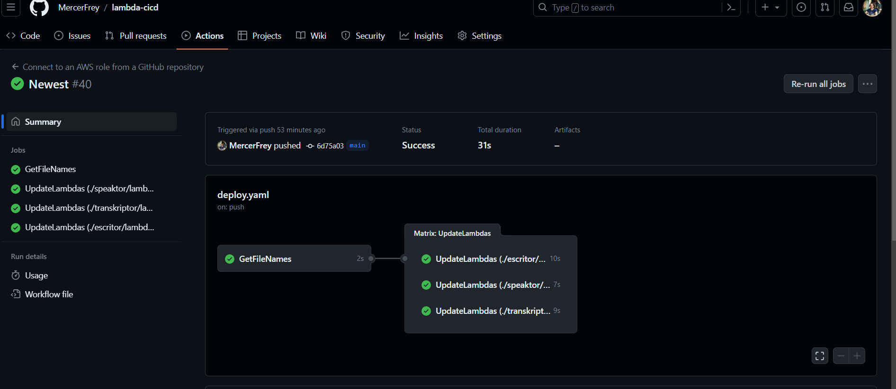

# lambda-cicd

This repository is the CI/CD pipeline for the multiple Lambda functions. Whenever a commit to the main branch occurs, the workflow automatically detects python files and updates them accordingly. 

These three lambda functions are updated with a commit on the Github. The worklflow run and updated them on the AWS.

## TODO 
- Learn CDK to automatically add lambdas to the AWS
- It does not create new lambdas. There should be existing lambda files in order to update.
- It should only update the functions that are changed.
- A cache can be added if the builds are too long